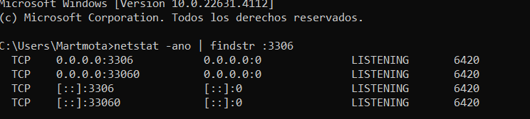

Esto es lo que hacer la prroxima vez que no me funcione el servidor xampp con mysql

Para solucionar el problema con MySQL en XAMPP, sigue estos pasos:

1. Verifica el Puerto en Uso
Identifica qué aplicación está utilizando el puerto 3306:

Abre el Símbolo del sistema (CMD) y ejecuta el siguiente comando para ver qué está usando el puerto:

netstat -ano | findstr :3306

El número en la última columna es el ID del proceso (PID). Usa el Administrador de tareas para identificar la aplicación que corresponde a este PID.
2. Detén la aplicación en conflicto o cambia su puerto.



PID 6412


```sql	
SELECT correos.*,
    remitente.nombre AS remitente_nombre, 
    remitente.email AS remitente_email, 
    remitente.image AS remitente_image, 
    destinatario.nombre AS destinatario_nombre, 
    destinatario.email AS destinatario_email 
    FROM correos 
    JOIN usuarios AS remitente ON remitente.id = correos.remitente_id
    JOIN usuarios AS destinatario ON destinatario.id = correos.destinatario_id
```


cloud untropic

llama gpt